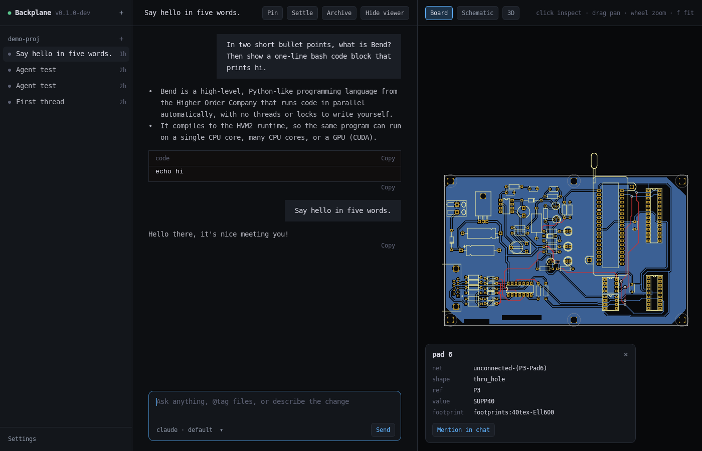

# Backplane (Bend)

An agentic hardware development environment, written in
[Bend](https://bend-lang.com). It pairs agent threads (Claude Code and
Codex) with live KiCad viewers, in a native window drawn entirely by Bend.

- **Threads** per project, as in T3Code. They go *Settled* after three days of inactivity (configurable), and everything is kept in a local event log. Each thread picks its provider and model.
- **Models working together.** An agent can delegate tasks to other models through Backplane's MCP tools. The subagent viewer shows each child task, its model and state, under its parent thread. Laws bound the delegation depth and deliver each result exactly once.
- **KiCad viewers that stay truthful.** Board, schematic and 3D tabs follow the project's canonical files live, never a half-written save. Only what changed fades in. Click any pad, track, symbol or pin to see what it is (net, ref, value, footprint) and mention it in chat. STEP files open in the 3D view.
- **KiCad-aware agents.** Every agent is told the exact kicad-cli to use and the project's canonical files (from `.backplane.json` or the `.kicad_pro`). They also get the [KiStack](https://github.com/American-Embedded/KiStack) skills, pinned. With the [Backplane KiCad fork](https://github.com/i2cjak/Backplane_KiCad) they also get its IPC API server, which you can turn off in Settings. Settings can also install the fork.
- **A browser for the agents.** It is Chrome: an installed Google Chrome, or Google's Chrome for Testing, which Backplane downloads. Agents drive it with `preview_*` tools, and you watch it live in the Browser tab.
- **Laws.** The rules that matter are stated in [`LAWS.bend`](LAWS.bend) and proven in [`PROOF.bend`](PROOF.bend). `bend PROOF.bend` checks every one.
- **Anywhere on your tailnet.** `backplane --tailscale` serves the web client to your other devices, gated by a pairing token.



## Install

```sh
curl -fsSL https://github.com/i2cjak/backplane-bend/releases/latest/download/install.sh | sh
backplane
```

This installs into `~/.local/share/backplane` and links the binaries into `~/.local/bin`.

- The installer checks the sha256 of what it downloads.
- Backplane updates itself from GitHub releases. Set `BACKPLANE_NO_UPDATE=1` to turn that off.
- `backplane` opens the window. Without a display it keeps serving the web client on `127.0.0.1:3787`.
- `backplane-serve` runs headless.

## Build

You need [Bend](https://bend-lang.com), clang 19+, X11 headers (`libx11-dev`), and bun for the tests.

```sh
scripts/check.sh   # type-check everything, prove every law
scripts/test.sh    # unit tests
scripts/build.sh   # dist/backplane, dist/backplane-serve, dist/web (+ helpers with bun)
scripts/smoke.sh   # start the built server and poke it
```

[AGENTS.md](AGENTS.md) describes the layout and the Bend traps worth knowing.

## Laws

| Law | Promise |
|---|---|
| `settle_*` | A thread settles after its window, stays settled as time passes, and never while running, waiting on you, or brought back by hand. |
| `replay_snoc` | The live view and a cold replay of the log never disagree. |
| `sidebar_split_count` | Every thread is on exactly one sidebar shelf. |
| `scene_merge_self` | Re-reading an unchanged board re-fades nothing. |
| `fade_start`, `fade_done` | Fades start invisible and always finish. |
| `update_never_same` | The updater never offers the version already running. |
| `task_*`, `delegation_bounded` | A finished task never changes again or goes back to the queue. Its result reaches the parent once. Delegation stops at a fixed depth. |
| `setting_default` | A setting never set reads as its default. |
| `stale_board_ignored` | A file read for a view you have left changes nothing on screen. |

## License

MIT. See [LICENSE](LICENSE). `backplane-step2glb` embeds OpenCascade (LGPL-2.1); its notices ship in `licenses/`.
